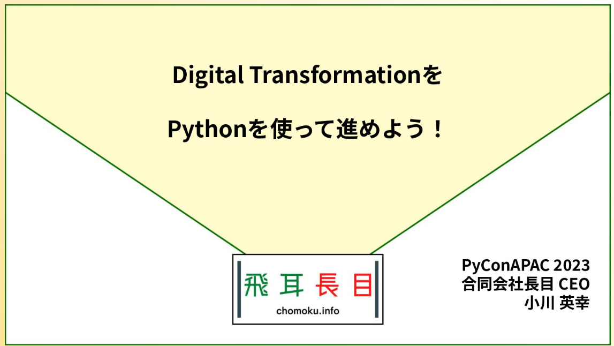

# pyconapac2023

[PyConAPAC2023](https://2023-apac.pycon.jp/)の[「Digital TransformationをPythonを使って進めよう！」](https://2023-apac.pycon.jp/timetable?id=3AFMSE) by 小川英幸(X: [@ogawahideyuki](https://twitter.com/OgawaHideyuki))登壇資料

## 日時

2023/10/28 13:55 - 14:10

## プレゼン資料

- [speakerdeck](https://speakerdeck.com/hideyuki_ogawa/digital-transformationwopythonwoshi-tutejin-meyou)

## data

### data/all_data.csv 
札幌市のオープンデータを取得して作成

- [札幌市丸山動物園の入場者数](https://ckan.pf-sapporo.jp/dataset/sapporo_maruyama_zoo_visitors): CC by 4.0
- [札幌市内の気象観測記録](https://ckan.pf-sapporo.jp/dataset/sapporo_weather): CC by 4.0
- [地下鉄改札による上社員データ](https://ckan.pf-sapporo.jp/dataset/tikatetu_jyousyajinnin): CC by 4.0
- [札幌地下街人流データ](https://ckan.pf-sapporo.jp/dataset/sapporotikagaijinryuude-ta): CC by 4.0

## notebook

- panelを使ったインタラクティブな可視化: [Google Colab](https://colab.research.google.com/github/mazarimono/pyconapac2023/blob/main/panel_watch.ipynb)
- lightGBMを使ったモデル作成: [Google Colab](https://colab.research.google.com/github/mazarimono/pyconapac2023/blob/main/model.ipynb)

## 概要

